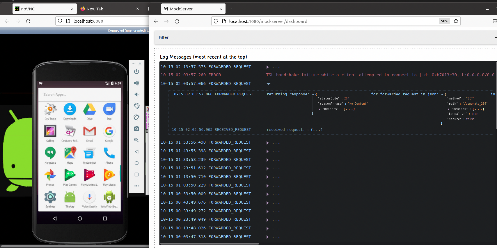

# Android Tests with Mock Server

This repo shows how you can set up an stack to run your android tests with both **mocking** and **forwarding** HTTP requests by proxing your android emulator to a [**Mock-Server**](https://mock-server.com/) container.

## If you are on a Linux system

> Android Container + Mock-Server

### Prerequisites:

* Docker

### Getting Started

1) Clone this project and go to the root of the repo

2) Add all your simulated responses ([expectations](https://mock-server.com/mock_server/creating_expectations.html)) inside folder `mock-server/mocks`. Then, you need to group them on the file `mock-server/initializer.json`, for this purpose just run following command:

        print 'Y\n' | sudo apt install jq; cat `find ./mock-server/mocks/* -name \*.json -type f \( ! -name initializer.json \)` | jq -s 'flatten' > ./mock-server/initializer.json

*Note:* you can find sample mocks inside folder `mock-server/mocks/examples`

3) Replace the `android/sample_app.apk` with your own apk file. 

4) Start android + mock-server containers with following command:
    
        docker-compose up -d

5) Interact with your android emulator device exposed at url http://localhost:6080

6) That's it, you are ready to go and test your android application with mocked HTTP responses. 

## If you are on a Mac OS X

> Mock and forward HTTP Request with Mock-Server on Android device

### Prerequisites:

* Docker
* Android Studio 
* Create an android emulator (API <= 28, without Play Store) using avd manager.

### Getting Started

1) Clone this project and go to the root of the repo

2) Launch emulator device from command line:
    
        emulator -writable-system -netdelay none -netspeed full @<EMULATOR_NAME> 
      *Note*: replace `<EMULATOR_NAME>` with the emulator you want to use (run `emulator -list-avds` to list all device names)

3) Add all your mocked HTTP request and responses insdide folder `mock-server/mocks`. Follow this [guide to create expectations](https://mock-server.com/mock_server/creating_expectations.html) with Mock-Server.

4) Replace the `android/sample_app.apk` with your own apk file. 

5) Run following command to configure the whole setup
    
        bash android/setup.sh
    
6) Launch mock-server container with following command:
    
        docker-compose up -d mock-server

7) That's it, you are ready to go and test your android application with mocked HTTP responses. 

### Notes:

* The `setup.sh` file export environment variables, configure proxy on emulator, install ssl certificates, install sample apk and merge predefined mock expectations.
* Active expectations, received requests, proxied requests and matched expectations can be found at: http://localhost:1080/mockserver/dashboard
